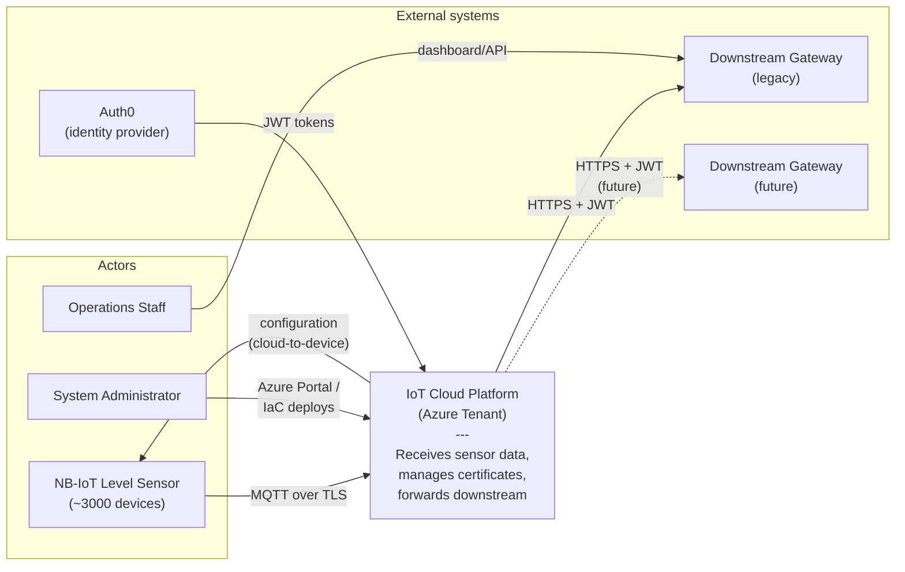
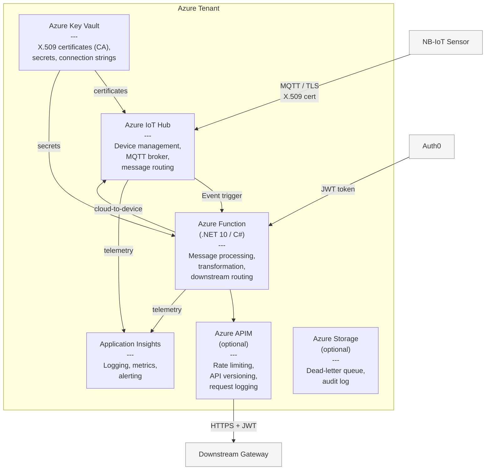
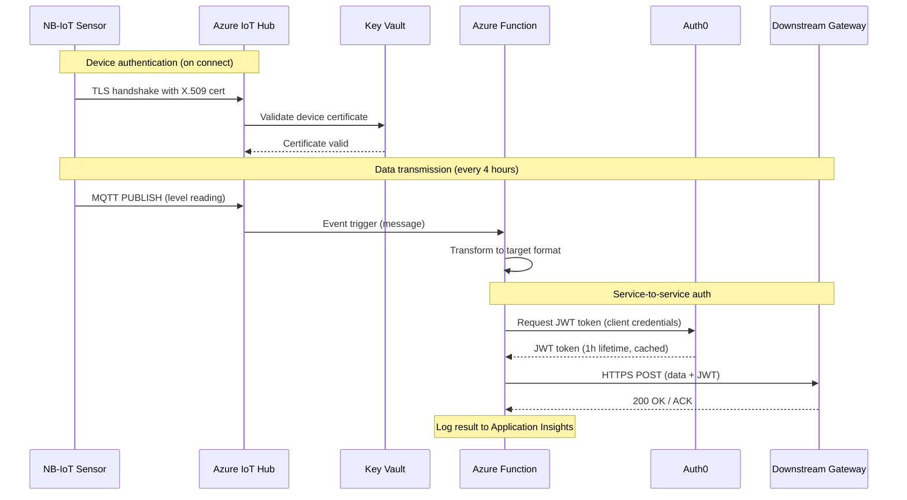
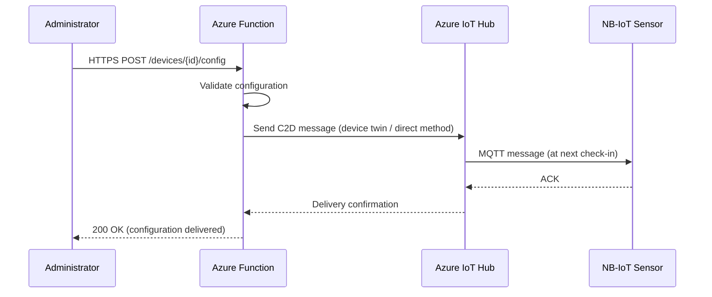

# Architecture — IoT Cloud Platform

## C4 Model

### Level 1: Context diagram

Shows the system as a whole and its relationships to external actors.



### Level 2: Container diagram

Shows the internal components of the Azure platform.



### Component responsibilities

| Component | Responsibility | Modularity |
|-----------|----------------|------------|
| **IoT Hub** | Device registry, MQTT broker, message routing, C2D messages | Replaceable by another MQTT broker — no vendor lock-in in the application layer |
| **Key Vault** | CA for X.509 device certificates, secrets for the Function | Standard certificate handling, can be migrated |
| **Azure Function** | Core logic: receive → transform → forward. Adapter pattern downstream | Can be relocated to other infrastructure as a container or service |
| **APIM** | Optional layer for throttling, versioning and logging of outbound calls | Can be removed without affecting the Function |
| **Application Insights** | Observability for the whole platform | Replaceable by another monitoring solution |

---

## Sequence: sensor data to downstream gateway

Normal flow for a level reading from sensor to the downstream system.



## Sequence: cloud-to-device configuration

Sending a configuration message to a device.



---

## Design decisions

### Message format

Telemetry from sensor to IoT Hub follows a versioned JSON contract. The device transmits
raw measured values; conversion to volume is a cloud responsibility, so calibration can be
corrected without an OTA campaign across the fleet.

- Contract: [`mqtt-payload.md`](mqtt-payload.md)
- Normative schema: [`schemas/telemetry-v1.schema.json`](schemas/telemetry-v1.schema.json)
- Rationale: [ADR-004](adr/adr-004-message-format.md)

### Adapter pattern for downstream integration

So that migration from a current to a future downstream interface stays cheap:

```
Azure Function
    └── IDataForwarder (interface)
            ├── GatewayV1Forwarder       ← current gateway format
            └── GatewayV2Forwarder       ← future format (stub)
```

Forwarder selection is driven by configuration (environment variable / app setting) rather
than a code change. Both implementations can run in parallel during a transition period.

### Modularity for hand-over

Components are designed so that an operator can take over parts of the platform:

```
          Can be relocated
                   │
    ┌──────────────┼──────────────┐
    ▼              ▼              ▼
 Function     APIM policies   Auth0 config
(container)   (export/import)  (tenant transfer)
    │
    └── IoT Hub remains in the platform tenant
        (or is migrated separately)
```
